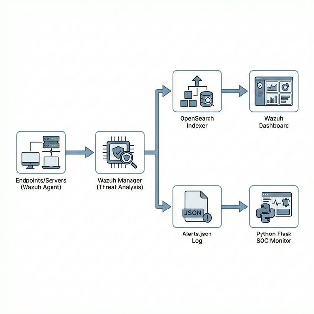
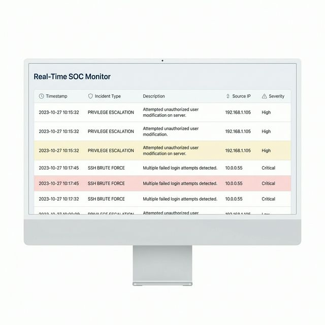

# Real-Time SOC Monitoring & Incident Response System
## Presentation Outline

---

### 1. Abstract
The **Real-Time Security Operations Center (SOC) Monitoring & Incident Response System** is a production-grade security architecture designed to provide centralized, real-time threat detection and visibility. Built upon the Wazuh SIEM ecosystem (Wazuh Manager 4.7.2, OpenSearch 2.11) and augmented with a custom Python-based SOC web monitor, this system automates the ingestion, correlation, and classification of endpoint security events. It specifically targets critical attack vectors such as SSH Brute-Force attempts, Privilege Escalation (sudo abuse), and unauthorized file modifications. By streamlining complex SIEM data into an intuitive, color-coded live feed, the project drastically reduces incident response latency and bridges the gap between raw log collection and actionable security intelligence.

---

### 2. System Requirements

**Hardware Requirements:**
*   **Processor:** Quad-Core CPU (Minimum), Octa-Core recommended for heavy log ingestion
*   **RAM:** 8 GB Minimum (16 GB Recommended for OpenSearch indexing)
*   **Storage:** 20 GB free disk space (40 GB Recommended for log retention)

**Software Requirements:**
*   **Operating System:** Ubuntu 22.04 LTS (Linux Native or WSL2)
*   **Containerization:** Docker 24.x+ and Docker Compose v2.x+
*   **Languages/Frameworks:** Python 3.9+ (Flask frontend)
*   **Core Systems:** Wazuh Manager, Wazuh Agent, OpenSearch, Filebeat

---

### 3. Existing System and Proposed System

#### Existing System
Traditional or smaller-scale security monitoring often relies on manual review of decentralized log files (e.g., `auth.log`, `syslog`) using basic command-line tools. 
*   **Drawbacks:** It lacks real-time correlation across multiple endpoints, produces high false-positive rates, requires heavy manual intervention to identify complex attack patterns, and provides no intuitive visual dashboard for Junior Analysts to rapidly classify threats.

#### Proposed System
The proposed solution implements a **centralized, containerized SIEM architecture** utilizing Wazuh and OpenSearch, paired with a custom lightweight **Quick SOC Monitor**.
*   **Advantages:** Provides automated threat detection rules, instant visual alerts via a Flask dashboard, automated File Integrity Monitoring (FIM), and built-in CIS policy compliance checks. The Dockerized nature allows for "One-Click Deployment" across any environment, completely abstracting the complexity of SIEM setup.

---

### 4. Modules

1.  **Endpoint Sensor Module (Wazuh Agent):** Runs with elevated privileges on target machines, actively intercepting syslog, authentication logs, and filesystem changes, and securely forwarding them to the manager.
2.  **Analysis & Detection Engine (Wazuh Manager):** The core rule engine that correlates incoming log data against thousands of predefined MITRE ATT&CK patterns, escalating alerts based on severity and frequency.
3.  **Indexing & Storage Module (OpenSearch):** A high-performance, distributed search database that stores all processed alerts and provides full-text search capabilities and long-term retention.
4.  **Live Action Dashboard (SOC Monitor):** A custom Python/Flask web application running on port 8081 that parses the continuous alert stream and translates raw JSON logs into a human-readable, color-coded live feed.
5.  **Attack Simulation Engine:** A modular bash script suite used to programmatically simulate advanced threats (SSH Brute Force, setuid execution) to validate the integrity of the detection pipeline.

---

### 5. Data Flow Diagram

**Flow Description:**
1. Attackers trigger events on the Host OS (e.g., failed SSH login, privilege escalation).
2. The Wazuh Agent captures these events from local log files.
3. Events are sent over a secure, encrypted channel to the Wazuh Manager.
4. The Manager decodes, analyzes, and matches the events against security rules.
5. Validated Alerts are sent simultaneously to two destinations:
   - **OpenSearch Indexer** (for long-term SIEM storage and Wazuh Dashboard visualization).
   - **Alerts.json Log File** (read in real-time by the Python SOC Monitor).
6. The Analyst views the finalized incident classifications on the SOC Monitor UI.

---

### 6. Table Structure / Data Schema

While the system does not use a traditional SQL relational database, it relies on structured **JSON Document Schemas** stored within OpenSearch and parsed by the frontend. 

**Alert Document Schema Example:**
| Field Name | Data Type | Description |
| :--- | :--- | :--- |
| `id` | String | Unique Alert Identification Hash |
| `timestamp` | Datetime | UTC Time of the security event |
| `rule.level` | Integer (0-15) | Severity score of the triggered rule |
| `rule.description`| String | Human-readable explanation of the alert |
| `agent.name` | String | Hostname of the impacted machine |
| `data.srcip` | String | Originating IP address of the attacker |
| `mitre.technique`| Array | Corresponding MITRE ATT&CK vectors |

---

### 7. Output Screen

*   **Quick SOC Monitor (Port 8081):** Displays a live, rolling feed of attacks. Critical incidents like "SSH Brute Force" are highlighted with Level 5+ severity flags and source IP extraction.
*   **Wazuh Dashboard (Port 443):** Provides deep-dive SIEM analytics, MITRE framework mapping, and compliance tracking metrics.

---

### 8. Future Enhancements

*   **Active Response Integration:** Implement automated firewall `iptables` rules that automatically ban IP addresses after recurrent Level 10+ alerts.
*   **Threat Intelligence Feeds:** Integrate AlienVault OTX or VirusTotal APIs into the Wazuh manager to cross-reference IPs and file hashes against global blacklists.
*   **Cloud Deployment:** Migrate the Docker Compose stack to a Kubernetes (K8s) cluster for high availability, auto-scaling, and failover support.
*   **Notification Plugins:** Introduce webhooks to forward critical alerts to Discord, Slack, or Microsoft Teams channels for the incident response team.

---

### 9. Conclusion
The Real-Time SOC Monitoring system successfully demonstrates the implementation of a modern, scalable cybersecurity defense mechanism. By containerizing enterprise-grade tools like Wazuh and OpenSearch, and bridging them with a custom Python classification dashboard, the project effectively reduces the time-to-detection for critical threats. It functions as both a robust educational platform for understanding SIEM architecture and a pragmatic tool for defending active network environments.

---

### 10. References and Bibliography

1.  **Wazuh Documentation:** Wazuh Official Documentation, *Wazuh Ruleset, Architecture, and Agent Deployment.* [https://documentation.wazuh.com](https://documentation.wazuh.com)
2.  **OpenSearch Documentation:** OpenSearch Foundation, *Distributed Search and Analytics Suite.* [https://opensearch.org/docs/](https://opensearch.org/docs/)
3.  **MITRE ATT&CK Framework:** The MITRE Corporation, *Enterprise Matrix and Threat Modeling.* [https://attack.mitre.org/](https://attack.mitre.org/)
4.  **Docker Documentation:** Docker Inc., *Docker Compose Networking & Orchestration.* [https://docs.docker.com/compose/](https://docs.docker.com/compose/)
5.  **Flask Web Development:** Grinberg, M. (2018). *Flask Web Development: Developing Web Applications with Python*. O'Reilly Media.
