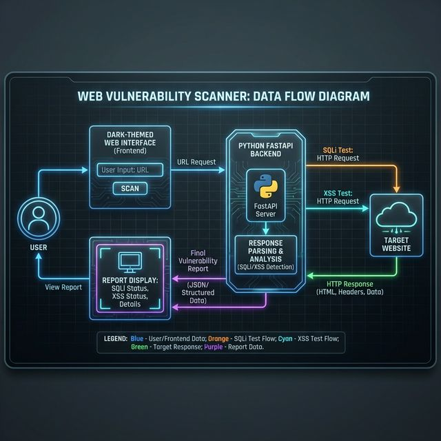
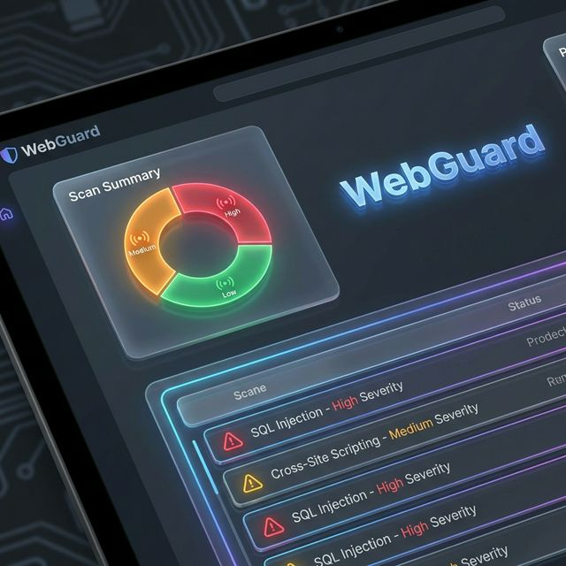

# WebGuard: Automated Web Application Security Scanner
## Final Year Project Presentation Outline

---

## 1. Abstract
WebGuard is a lightweight, automated web application security scanner designed to provide developers with immediate feedback on the security posture of their applications. Traditional penetration testing is often manual, time-consuming, and disconnected from the rapid development lifecycle. WebGuard bridges this gap by offering an intuitive, dark-themed web interface backed by a high-performance Python engine. It automatically identifies critical OWASP vulnerabilities—including SQL Injection (SQLi), Cross-Site Scripting (XSS), missing security headers, and Open Redirects—while enforcing strict safeguards to prevent scanning of internal or private networks. The system outputs real-time, categorized vulnerability reports, dramatically reducing the manual overhead required for basic security triage.

---

## 2. System Requirements

### Hardware Requirements
- **Processor**: Intel Core i3 or equivalent (minimum 2.0 GHz)
- **RAM**: 4 GB minimum (8 GB recommended)
- **Disk Space**: 1 GB available disk space
- **Network**: Active internet connection

### Software Requirements
- **Operating System**: Linux, macOS, or Windows
- **Execution Environment**: Docker and Docker Compose (Containerized version) or Python 3.9+ (Local execution)
- **Libraries/Packages**: FastAPI, requests, beautifulsoup4, uvicorn, jinja2
- **Web Browser**: Any modern browser (Google Chrome, Firefox, Edge, Safari)

---

## 3. Existing System and Proposed System

### Existing System
In the existing ecosystem, vulnerability scanning relies heavily on two extremes:
1. **Manual Penetration Testing**: Deeply accurate but extremely slow, unscalable, and requires highly specialized security experts.
2. **Heavy Commercial Scanners**: Tools like Nessus or Burp Suite Professional are powerful but can be overly complex for developers, resource-intensive, and expensive. They often require extensive configuration and are difficult to integrate into lightweight developer workflows.

### Proposed System
The proposed system, **WebGuard**, introduces a focused, developer-friendly automated scanner that:
- Runs instantly via Docker containers with zero configuration.
- Targets the most common and critical vulnerabilities efficiently.
- Uses strict IP validation to prevent accidental scanning of internal networks.
- Provides immediate, actionable HTML/JSON reports visually categorized by severity.
- Offers a sleek, modern UI designed specifically for ease-of-use.

---

## 4. Modules

The project is divided into the following core modules:

1. **User Interface (UI) Module**
   - Built using HTML5, CSS3, and JavaScript.
   - Provides a modern dark-themed interface for users to input target URLs.
   - Renders the final vulnerability report dynamically.

2. **API & Orchestration Module (FastAPI)**
   - Receives scan requests and manages asynchronous execution.
   - Validates the target URL and handles client-server communication using RESTful principles.

3. **Target Validation Module**
   - Resolves target hostnames to IP addresses.
   - Enforces safeguards by blocking scans against `localhost`, loopback, and private LAN IP ranges to prevent internal SSRF attacks.

4. **Crawler & Parser Module (BeautifulSoup4)**
   - Fetches the HTML content of the target URL.
   - Extracts all `<form>` elements, inputs, actions, and underlying methods (GET/POST) for payload injection.

5. **Vulnerability Engine Module**
   - **SQL Injection Engine**: Injects error-based payloads (e.g., `' OR 1=1 --`) and parses the response for database syntax errors.
   - **XSS Engine**: Injects `<script>` payloads into parameters and checks for unencoded reflection.
   - **Open Redirect Engine**: Tests common redirect parameters (e.g., `?next=`, `?url=`) to detect malicious redirection.
   - **Headers Engine**: Evaluates HTTP response headers for missing mitigations (e.g., CSP, X-Frame-Options).

---

## 5. Data Flow Diagram
The Data Flow Diagram visually represents how information moves through WebGuard. Users interact with the frontend, the backend dispatches analysis to the target, and finally returns the vulnerability report.

---

## 6. Table Structure
**Note on Data Persistence**: 
To prioritize user privacy and ensure a zero-footprint operation, WebGuard operates entirely statelessly. 
- The system executes scans in-memory and dynamically generates the report for the user's active session.
- Because it does not permanently log or store the vulnerabilities of third-party websites, **there is no relational database table structure** required for this system. This design prevents the scanner server from becoming a high-value target for attackers looking to harvest known vulnerability data.

---

## 7. Output Screen
Below is the output screen demonstrating how WebGuard categorizes vulnerabilities into High, Medium, and Low severity classifications, offering a clear and actionable dashboard for developers.

---

## 8. Future Enhancements
While WebGuard effectively handles basic surface-level scanning, it can be expanded in the future:
1. **Multi-level Crawling**: Implementing depth-based spidering to discover hidden endpoints beyond the homepage.
2. **DOM-based XSS Detection**: Integrating a headless browser (like Playwright or Selenium) to detect client-side DOM vulnerabilities that static HTML parsing misses.
3. **Automated PDF Reporting**: Adding a feature to export scan results as a professionally formatted PDF report for compliance audits.
4. **Authenticated Scanning**: Allowing the scanner to accept session cookies or login credentials to scan protected areas of a web application.

---

## 9. Conclusion
The WebGuard project successfully proves that automated vulnerability scanning can be both lightweight and highly effective. By combining an intuitive, modern user interface with a robust Python backend, the system demonstrates how critical flaws like SQL Injection and Cross-Site Scripting can be reliably detected. WebGuard empowers developers to proactively identify security weaknesses early in the deployment process, ultimately contributing to a more secure web ecosystem.

---

## 10. References and Bibliography
1. **OWASP Top 10**: The Open Web Application Security Project (https://owasp.org/www-project-top-ten/)
2. **FastAPI Documentation**: High-performance API framework (https://fastapi.tiangolo.com/)
3. **BeautifulSoup4**: HTML parsing library (https://www.crummy.com/software/BeautifulSoup/)
4. **Python Requests**: HTTP library for humans (https://docs.python-requests.org/)
5. **Docker Documentation**: Containerization architecture (https://docs.docker.com/)
